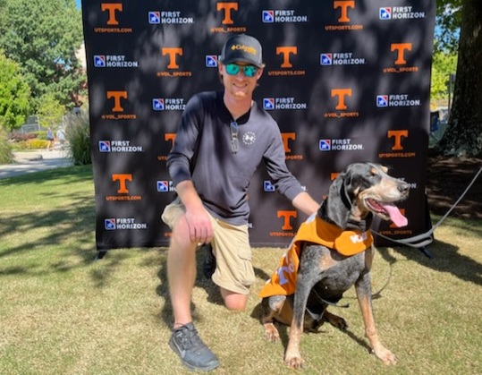

<body style = "background-image: linear-gradient(#D5D1CB, #58595B)"></body>
<div class="column"> </div>

<style>
.column{
    width:50%; 
    background-image: linear-gradient(#D5D1CB, #58595B);
    }
</style>

# Zach Dorminey
My name is Zach Dorminey. I am a first year Master's student in Geography at the Department of Geography and Sustainability at the [University of Tennessee, Knoxville](https://utk.edu) (UTK). I am focusing on quantitative methods in geographical information systems (GIS).

## Background
I am from Morgantown, West Virginia where I grew up and went to college at [West Virginia University](https://www.wvu.edu/) (WVU). I graduated from WVU with a BS in Civil Engineering and worked for about 2 years in the industry. After exploring some opportunities in geography, I decided to go back to school and pursue in-depth quantitative methods in geography.


## Research
My research interests include small area estimation, cluster analysis methods, and quantitative methods as a larger body of study. All my work points to my fascination with different methods to account for spatially related phenomena. I enjoy reading the original works foundational to quantitative methods in geography and learning how those works are vital to cutting edge research today.

### Poster Presentations
My most recent work, Assessing the Spatial Clustering of Right of Way Permits in Davidson County, Tennessee, utilizes Ripley's K function to compare the clustering tendencies of right of way permits to the distribution of addresses. I developed an R Shiny app in this work so that my methods are easily visualized and repeated with different datasets without the need for the user to have experience with GIS. I will presenting a poster on this work at GeoSym 2023 at UTK and at AAG 2023 Annual Meeting in Denver.
<!--Include the -->
```R
library("shiny")
library("spatstat")

ui <- fluidpage(
    #Asks user for input data to compare to addresses
)

server <- function(input, output, session){
    #output Ripley's K estimation
    Kest(right_of_way_permits)
}

```
### Forest Inventory and Analysis (FIA)
I currently work part-time with Dr. Nicholas Nagle (UTK) on USFS FIA research looking into new ways for small area estimation in accordance with the goals of the Southern Research Station.

```R
library("rFIA")
```
## Relevant Coursework
- GEOG 411 - Intermediate GIS
- GEOG 510 - Geographic Software Design
- GEOG 515 - Quantitative Methods in Geography
- STAT 578 - Categorical Data Analysis

## Teaching
In my time at UTK I have worked as a Graduate Teaching Assistant, serving as a TA for:
- GEOG 131 Weather/Climate/Climate Change
and 
- GEOG 132 Landscapes and Environmental Change

##  
##  
## Go Vols!
<!-- Markdown will also render HTML-->
<!-- for an image-->


